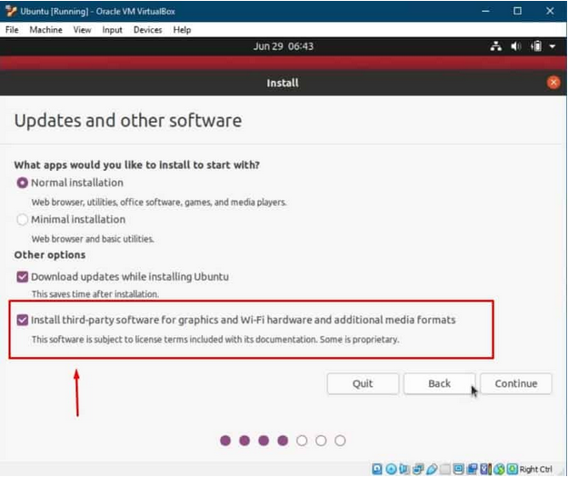

# Virtualbox on Windows 10
These instructions in general should work for mac as well.

The following Instructions were gathered from the following reference.
[reference](https://gadgetliv.com/install-ubuntu-on-virtualbox-in-windows/#:~:text=How to Install Ubuntu on VirtualBox in Windows,Restart Ubuntu after Installation. ... More items…)

### Step 1: Download Oracle VirtualBox

https://www.virtualbox.org/wiki/Downloads

Follow their instructions

### Step 2: Download Ubuntu OS ISO file
Go to ubuntu download page and get Ubuntu 20.04 
[Ubuntu iso page](https://ubuntu.com/download/desktop)

### Step 3: Open VirtualBox
Now open VirtualBox and Click on New button.

### Step 4: Setup VirtualBox
Give your virtual OS a relevant name. In my case, I am naming it Ubuntu.

Next, you need to allocate the RAM size.
* I HIGHLY SUGGEST YOU USE AS MUCH RAM AS YOUR MACHINE LETS YOU IN THE GREEN ZONE. It can mean the difference between a 9 hour (2GB ram) moveit build vs 3 hour (5GB ram) or less build.

Here I will go with the default hard disk set that is “create a virtual hard disk now” and click on Create.

Here also I will go with a default setting that is VDI and click on next.

Here you can either choose dynamically allocated or fixed size, both are excellent options. 
I used to picture from the reference site , but I actually used fixed memory and it worked fine.

Now you have to select the size of the virtual hard disk. Site suggested to use more than 15 GB. (I actually chose 16 and fixed memory to push the limits and checked that when moveit and ROS were all installed the machine total memory used in 14.2GB .. I HIGHLY SUGGEST you use more memory if you can that way we can have some cushion space for more packages and cat videos if desired.. ESPECIALLY if you're using fixed memory)

# Step 5: Insert the Ubuntu ISO file
Now select the newly created virtual os i.e. Ubuntu and click on Settings.

Now go to Storage. Click on empty which is under the Controller: IDE.
Next, click on the CD icon and click on the option “choose a disk file”.
Now go to the location where you have downloaded ubuntu and select the Ubuntu ISO file and click the OK button.

# Step 6: Select the Ubuntu OS file
Now select the Ubuntu OS and click on the Start button.

Next, select the optical disk that is the ubuntu ISO file and click on the Start button.

# Step 7: Setup Ubuntu OS
Now select your preferred language and click on the Install Ubuntu button.

Next, select the Keyboard layout, here I am choosing English US. You can select any other layout which you are using right now on your Windows 10 PC or laptop.
In the next window, you will see several options, here I will also check the “install third-party software” and click on the continue button.

Here in the installation type window, keep the default setting as it is and click on Install now button.

Here you will just receive a warning, which says if you continue the changes listed below will be written to the disks. I will just click on the continue button.

In the next step, select your location and click on continue.
Now the last thing you have to do is enter your name, computer name, username, and password and click on the continue button.

And finally, the Ubuntu OS installation process will begin. Now you don’t have to do anything, sit back and relax and wait for the completion of installation. It will take more than 30 minutes to install ubuntu on the VirtualBox.

# Step 8: Restart Ubuntu after Installation
After installation is complete, click on restart now.

# Step 9: Remove Ubuntu ISO file
Now make sure the downloaded ubuntu os ISO file is removed or else you might see errors. So make sure the CD is removed from the VirtualBox. In case you are seeing errors after installing you can simply close the VirtualBox and start again.

# Step 10: Welcome to Ubuntu
Now enter the password which you created during installation setup and you will be logged into Ubuntu desktop.

At this point the referenced tutorial can show you how to make it full screen if you want. 
I will now show you how to make sure the screen doesn't go blank when you are waiting for moveit to install. After we make the screen not go blank we can then focus on installing any updates the Software Updater wants you to do and then we can install moveit and ROS noetic.

Right click an empty part of the desktop and then press "Display Settings"

Now click "Power" (near the bottom)

Where it says Power Saving click on where it says "5 minutes" and change it to "Never"

Now you can install the Updated software ( it'll take a while if you chose a small amount of ram )

Ok we're done and can move forward with the ROS noetic and moveit instructions!

